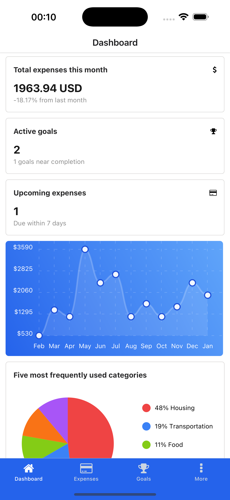
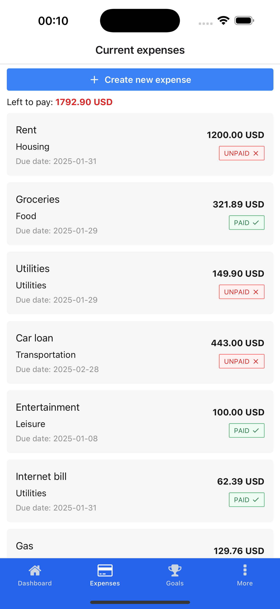
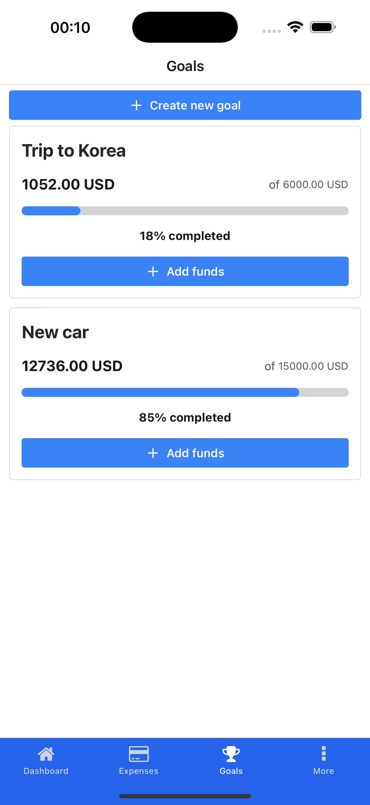
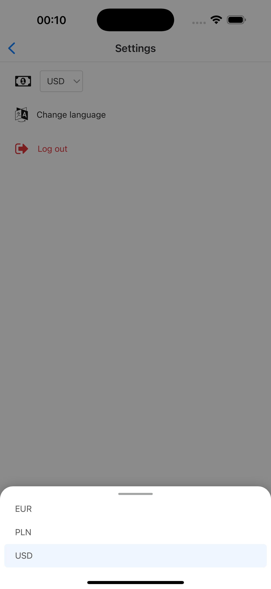
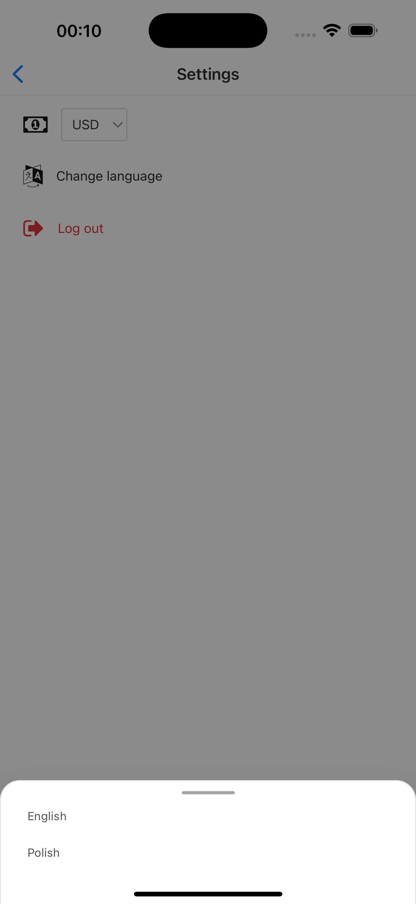

# NortBudget - Personal Budget Manager 💸


A modern mobile app for tracking expenses, setting financial goals, and analyzing spending habits. Built with Expo and React Native.

## Key Features ✨
- 📊 Track expenses with monthly comparisons
- 🎯 Create savings goals with progress tracking
- 📈 Visual spending breakdown by category
- 🌐 Multi-language support
- 💵 Multiple currency options

## Getting Started 🚀

1. Clone the repository
   ```bash
   git clone https://github.com/yourusername/NortBudget.git

2. Navigate into the project folder
   ```bash
   cd NortBudget

3. Install the dependencies:
   ```bash
   npm install

## Running the App 💨

1. Start the development server with Expo:
   ```bash
   npx expo start

## Screenshots 📱
<div style="display: flex; flex-wrap: wrap; gap: 10px; justify-content: space-between;">
  
  
  
  
  
  
</div>

